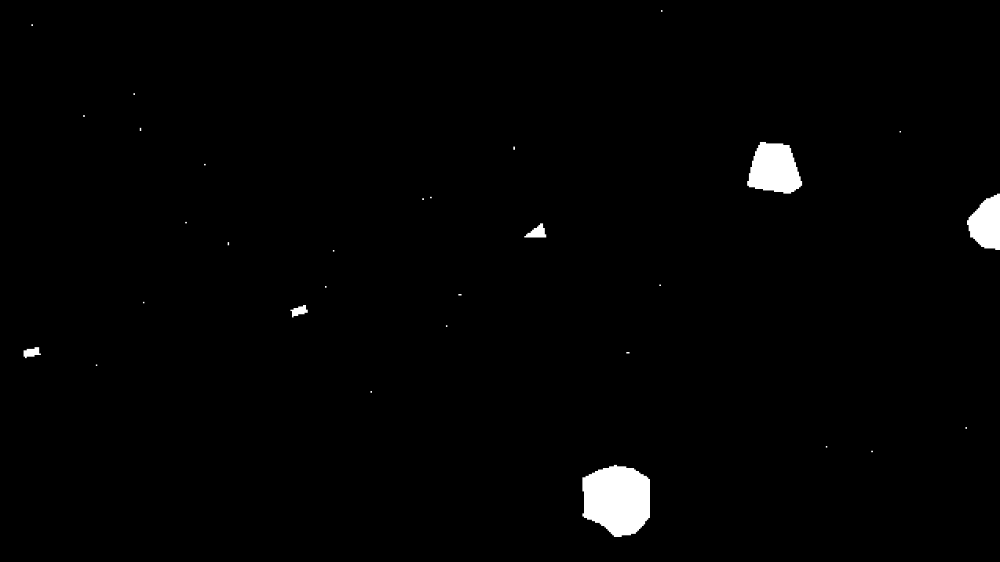

# GOLLY

### Game Oriented Lua Lisp.

Golly is a game library made in the Fennel programming language that runs on top of Love2D. Primarily it includes an opinionated object system with custom `class` and `mixin` macros for defining game entities.

This code is extremely experimental and undocumented, the API is changing daily. Working on an indie game project in parallel and building the parts of this engine when the game project necessitates them. If you're brave and want to play with the code please reach out to me for help. 

## Asteroids Example Game

For right now, the repo is just a love project. The main entry point to the example is [example-asteroids/init.fnl](example-asteroids/init.fnl). Run using `love ./`.

The example game is a basic asteroids implementation, but it shows off all the main major features of Golly.

## Basic Object System Overview 

```fnl
(require-macros :golly)

;; Mixin macro creates a function whos job is to populate
;; fields on the self table, destructively.
(mixin animal [self props]
  ;; Plain fn is used to create functions
  ;; functions in classes/mixins defined using fn should be pure, always
  (fn self.get-name []
    (or self.name "anonymous"))
  ;; on is used to create event handlers 
  ;; on should be used whenever there are side effects or the 
  ;; desire to create an extension point.
  ;; Return value of ev handlers is ignored
  (on :greet []
    (print "Hello, I am " (self:get-name))))

;; Class macro creates a function that returns an object with the `Class`
;; metatable to handle all the event handler special logic
(class alligator [self props]
  (set self.name "Alligator")
  (mixins animal)
  ;; Event handlers can be subscribed to multiple times. 
  ;; The handlers will be invoked in the order subscribed
  (on :greet []
    (print "grr")))

(class penguin [self props]
  (mixins animal)
  (set self.name "Penguin"))

(let [a (alligator)
      p (penguin)]
  (a:greet)
  (p:greet))
```

The above script gives the following output.

```
fennel scratch.fnl
Hello, I am     Alligator
grr
Hello, I am     penguin
```



